# Game Design Document

## Tom Flux

## Contents

- [Game Design Document](#game-design-document)
  - [Tom Flux](#tom-flux)
  - [Contents](#contents)
  - [Analysis](#analysis)
    - [Client Brief](#client-brief)
    - [Requirements](#requirements)
    - [Investigation](#investigation)
      - [Design Ideas](#design-ideas)
        - [Kart Racing](#kart-racing)
        - [Roguelike](#roguelike)
        - [Physics based puzzle game](#physics-based-puzzle-game)
      - [Game Ideas Review](#game-ideas-review)
  - [Game Design](#game-design)
    - [Game Name](#game-name)
    - [Pitch](#pitch)
    - [Tagline](#tagline)
    - [Platform](#platform)
    - [Project Plan](#project-plan)
    - [Project Log](#project-log)
    - [Legal and ethical considerations](#legal-and-ethical-considerations)
    - [Story](#story)
    - [Audience](#audience)
    - [Type of gameplay](#type-of-gameplay)
      - [Mechanics](#mechanics)
      - [Controls](#controls)
    - [Storyboard](#storyboard)
      - [Visual design](#visual-design)
    - [Data Dictionary](#data-dictionary)
    - [Asset List](#asset-list)
    - [Algorithms](#algorithms)
    - [Testing](#testing)
      - [Testing Environments](#testing-environments)
      - [Tests](#tests)
      - [Playability](#playability)
      - [Compatibility Test](#compatibility-test)
      - [Stability Test](#stability-test)
      - [User Acceptance Tests (UAT)](#user-acceptance-tests-uat)
    - [Evaluation](#evaluation)
    - [Appendix](#appendix)
      - [Screenshots](#screenshots)
      - [Code](#code)
        - [buttonScript.cs](#buttonscriptcs)
        - [dugeonGen.cs](#dugeongencs)
        - [fightManager.cs](#fightmanagercs)
        - [gameManager.cs](#gamemanagercs)
        - [uiGen.cs](#uigencs)

## Analysis

### Client Brief

A game for children between eight to twelve-year olds, that involves collecting items in levels that progress in difficulty as the player goes through the game. The game should have a timer that, once it runs out, ends the game. It should also be exciting and fun to play, as well as visually appealing.

### Requirements

From the client brief I have extracted these requirements:

1. Be for 8 to 12-year olds.
2. Simple to learn.
3. Exciting to learn.
4. Visually appealing.
5. The basic gameplay should be moving around an area, collecting items and with obstacles.
6. The player should also have several lives; these lives are used up by hazards.
7. There should also be a timing aspect that contributes to an overall score.
8. Different levels of difficulty should be implemented to make the game more challenging for easier for the player.

### Investigation

#### Design Ideas

Using the brief I have brainstormed three ideas that could potentially fit the requirements. I will only chose one afterwards to actually make.

##### Kart Racing

- Story: the player competes in several races to earn points and eventually different cups. These races will also be timed, so players can compete against each other.
- Gameplay: Like other arcade kart racers, there will be items on the track that help the player win the race (i.e. speed boost and items that slow down other racers). Player would also be able to customise the race, for example changing the types of items available along or how many laps there are in the race.
- Type of game: This will be a 3D game.
- Targeted platforms: Mobile platforms, such as the Nintendo Switch or phones.
- Influences: Mario Kart, Need for Speed, Burnout.

##### Roguelike

- Story: the player will have to navigate randomly generated rooms in a post-apocalyptic world and fight enemies to survive.
- Gameplay: this game will follow some of the rules defined in the rogue genre, however bringing new ideas from other games in, thus making it rogue like. The player will fight in a turn-based system, be able to level up their stats and collect items to better survive.
- Type of game: This will be a 2D game.
- Targeted platform: PC and home-consoles, such as the PlayStation 4 and Xbox One.
- Influences: Binding of Isaac, Pokémon, Dark Souls.

##### Physics based puzzle game

- Story: using items gathered through-out the game, the player must solve puzzles using items that have physics. These might be as simple as moving a box to a hole or a whole room with many interconnected systems to open the final door.
- Gameplay: the player will be able to make use of many items given to them, such as a levitation tool, a water producer and many more. The goal of each stage is to get to open the door.
- Type of game: This will be a 3D game.
- Target platform: PC and home-consoles, such as the PlayStation 4 and Xbox One.
- Influences: Portal, the swapper, trine.

#### Game Ideas Review

I had two of my peers review the game ideas, this will help me decide which game to chose.

| Game Name | George Messenger | Alex Barlaam | Comments |
| --------- | ---------------- | ------------ | -------- |
| **Kart Racing** | "I feel this game best fits the requirements. It would be very appealing for 8-12 year olds if it the visual design was bright and vibrant." | "This game fits all the requirements, however might be hard to code due to the 3D nature." | I agree with both of these comments, however, as Alex pointed out, with my limited Unity ability it might be hard to create within the time scale |
| **Roguelike** | "Most of the requirements could be met with this game, however the setting might not appeal to 8-12 year olds." | "This game also fits with all of the requirements and would be easier for you to create. I think the setting does appeal to 8-12 year olds." | I again agree with the feedback, however I think George was wrong and I once again agree with Alex that this game would appeal to 8-12 year olds" |
| **Physics based puzzle game** | "The game idea here is a bit nebulous and hasn't been expanded upon. Along with this it does not appeal to the main demographic." | "This would not fit the requirements in the way you have described it. It would also be hard to code in the limited time frame." | Both of these pieces of feedback are fair. The game would be hard to code and I don't have a good picture in mind for what the game would be."

## Game Design

I will choose the “Roguelike” game idea as it best fits the client’s requirement. The other game ideas will also be a lot harder to code with my limited unity knowledge. Along with this, George and Alex both thought the game fit the game requirements.

### Game Name

**Dead or Alive: extreme.**  
I have chosen this name as it relates to the game, with the player being in a post-apocalyptic world. Along with this is fits the requirements of being appealing to 8-12 years old, due to the types of words used.

### Pitch

**Alone in a hell scape, you must level up and train your creatures to make sure you can survive. Use tactics and skill to aid you in your fight!**  
This fits the requirements as many 8-12-year-old children find the idea of zombies exciting and cool. The game would also be something new that they have not played, most games for this age are first-person-shooters, but still has the themes (such as the zombies) that they would be familiar with. The gameplay can also fit with the other requirements, such as a scoring system and a time aspect.

### Tagline

**Survive the apocalypse one fight at a time.**  
This tag line is short, which means that children are likely to read all of it. This is needed as it is one of the requirements. It does, however, get across the challenge of the game, with it sounding difficult to get through each of the fights. It also explains the premise of the game, having to survive in the apocalypse.

### Platform

This game will be developed for PC, as it has one of the widest reaches and it is easy to develop for with unity, unlike of propriety consoles. This platform will also allow me to meet all the requirements of the game as the PC is normally not limited by performance on what it can achieve in terms of gameplay.

### Project Plan

This is a plan of what I need to do when. To create this plan, I broke down each section of my project into smaller pieces then estimated how long each part would take. These estimates came from two places, my experience doing an extended project at college (creating a code-based project) and doing some of the sections beforehand, then using that in order to get more precise predictions

| **Name** | **Duration** | **Start** | **Finish** |  
| :------ | :----------: | :-------: | :--------: |
| ***Project*** | 85 Days | 10/12/2018 | 10/05/2019 |
| **Analysis** | 4 Days | 10/12/2018 | 14/12/2018 |
| Client Brief | ½ Day | 10/12/2018 | 10/12/2018 |
| Requirements| ½ Day | 10/12/2018 | 10/12/2018 |
| 3 Game Ideas | 1 Day | 11/12/2018 | 11/12/2018 |
| Feedback on Design | 1 Day | 12/12/2018 | 12/12/2018|
| Justification **|** 1 Day | 13/12/2018 | 13/12/2018 |
| **Game Design** | 24 Days | 13/12/2018 | 05/01/2019 |
| Name, Tag Line, Pitch | 1 Day | 13/12/2018 | 13/12/2018 |
| Platform and Project Plan| 1 Day | 14/12/2018 | 14/12/2018 |
| Legal and ethical | 1 Day | 15/12/2018 | 15/12/2018 |
| Story | 1 Day | 16/12/2018 | 16/12/2018 |
| Audience | ½ Day | 17/12/2018 | 17/12/2018 |
| Type of Gameplay | 3 Days | 18/12/2018 | 21/12/2018 |
| Storyboard | 2 Days | 18/12/2018 | 23/12/2018 |
| Data dictionary | 1 Day | 18/12/2018 | 24/12/2018 |
| Asset dictionary | 1 Day | 01/01/2019 | 01/02/2019 |
| Algorithms | 2 Days | 02/01/2019 | 04/01/2019 |
| Designing tests | 1 Day | 05/01/2018 | 05/01/2019 |
| **Game Development** | 117 Days | 06/01/2019 | 01/05/2019 |
| **Finishing project** | 9 Days | 02/05/2019 | 10/05/2019 |
| Testing | 2 Days | 02/05/2019 | 03/05/2019 |
| Evaluation | 7 Days | 04/05/2019 | 10/05/2019 |

### Project Log

This is a log of my activity during this project. It documents the length of time it took me to complete each section listed in the previous section, so includes my Games Design Document (GDD) and game development information.

| Date | Topic |
| :----: | :---- |
| 06/12/2018 | Started Pre-GDD |
| 09/12/2018 | Finished Pre-GDD |
| 10/12/2018 | Analysis |
| 12/12/2018 | Finished Analysis |
| 15/12/2018 | Started GDD |
| 18/12/2018 | Started game development |
| 10/04/2019 | Finished game development |
| 20/04/2019 | Finished GDD |
| 01/05/2019 | Started testing |
| 05/05/2019 | Finished testing |
| 05/05/2019 | Started evaluation |
| 09/05/2019 | Finished evaluation |

### Legal and ethical considerations

Three main legal and ethical considerations

- **Royalty** – This is a when someone pays the creator of a product to be able to use it commercially. The product much be legally owned by the creator (i.e. patent, copyright) for the creator to charge a fee for using it.
- **Copyright** – This grants to creator a of piece of work exclusive rights over who uses the product and if they are going to charge for the use of their work (royalty). If someone does not pay royalty when it is required it is known as copyright infringement.
- **Digital Right Management** - A piece of software that tries to protect the creator’s copyright by restricting who can access the work. In order to get past digital right management software, a user must pay the creator.  

I will take into consideration all of these when making my game.

### Story

_The F-Virus, a bio-weapon that turns animals into killing machines, has broken out in Vatican City after a scientist went crazy in his underground laboratory. All authorities have failed to save the city from the virus, now the citizens must fend for themselves and try and get out of the never-ending maze of the fallen Vatican City.  
Arnold is one of those unlucky people that must survive. He has only his wits and strength to get him out, but with the help of small shops that survivors have set up and campfires left behind by people that fled, this job might just be slightly easier._

### Audience

I will be targetting casual players that are looking for a quick game to play when they don’t have a lot of time, between the ages of 8-12. The mechanic will allow for strategizing, but the learning curve will allow anybody to play the game quickly.

### Type of gameplay

#### Mechanics

- **Fighting**: Turn based fighting. The player has three options: fight, open bag or run. Fight has four moves that are of varying affects. Open bag allows the player to access their items and use them. Run allows the player to leave the fight, however, it is not always successful.
- **Levelling up**: At camps, the player can level up both themselves and their creatures. This allows the player to make the game easier for the selves. Levelling up with be done by collecting XP from killing enemies.
- **Moving around the world**: The player should be able to move around the world, here they can find camps to level up, buy items in the shop and fight enemies.
- **Shop system**: Coins can be picked up when the player kills enemies. When the player finds a shop, they can buy new items to help them in the game and pay for them with the coins that they pick up.
- **Item pickups**: the player can find items around the world. These are normally worse than the items that can be bought in the shop but are free. Sometimes these items are better than those found in the shop, but these are very rare.

#### Controls

Keyboard controls. WASD will be for basic navigation. The controls will be simplistic, as the game is for younger people, so they don’t get confused.

### Storyboard

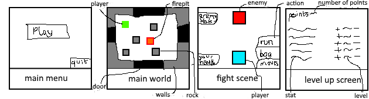

#### Visual design

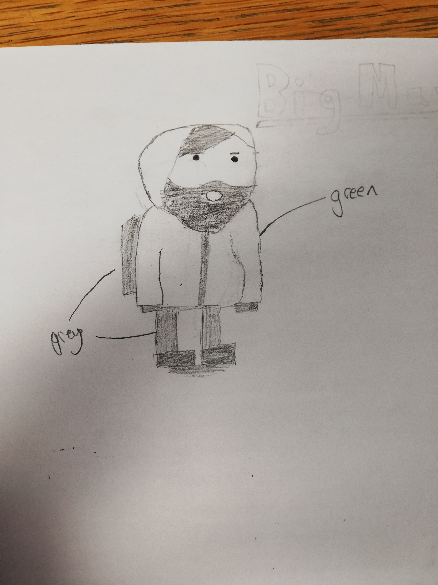

### Data Dictionary

| Name           | Script              | Data Type                       | Scope   | Purpose                                                                                                                                                                            |
|----------------|---------------------|---------------------------------|---------|------------------------------------------------------------------------------------------------------------------------------------------------------------------------------------|
| Int_stats      | ButtonScript.cs     | Dictionary<string, string>      | private | Holds information about which buttons should have which text when initialising buttons for stats scene.                                                                            |
| _ps            | ButtonScript.cs     | Dictionary<string, int>         | private | Holds the players currents stats                                                                                                                                                   |
| StartPoints    | ButtonScript.cs     | int                             | private | The amount of upgrade points the player had when they started to stat UI, so they can’t get more than they started with                                                            |
| lives          | GameManager.cs      | int                             | public  | The number of lives the player currently has.                                                                                                                                      |
| play           | GameManager.cs      | bool                            | public  | If the player is allowed to move                                                                                                                                                   |
| canvas         | GameManager.cs      | GameObject                      | public  | The canvas for the stat upgrade screen                                                                                                                                             |
| eventSystem    | GameManager.cs      | GameObject                      | public  | The event system object, that is needed so for buttons to work                                                                                                                     |
| scene          | GameManager.cs      | string                          | public  | Current scene on screen                                                                                                                                                            |
| Current_dugeon | GameManager.cs      | Dictionary<Vector3, GameObject> | private | The room that was destroyed when changing scene. Required for when the player wants to switch back to the dugeon. For example, world scene to fight scene and back to world scene. |
| PlayerXY       | GameManager.cs      | Float[]                         | private | The players coordinates before they were destroyed. Same reason as current_dungeon variable                                                                                        |
| enemy          | GameManager.cs      | GameObject                      | public  | Holds the enemy prefab.                                                                                                                                                            |
| playerf        | GameManager.cs      | GameObject                      | public  | Holds the fighting player prefab.                                                                                                                                                  |
| fightUI        | GameManager.cs      | GameObject                      | public  | The UI for the fight scene                                                                                                                                                         |
| Player_stats   | GameManager.cs      | Dictionary<string, int>         | public  | The player’s current stats                                                                                                                                                         |
| Difficulty     | GameManager.cs      | string                          | public  | The current difficulty                                                                                                                                                             |
| Damage_mod     | GameManager.cs      | float                           | public  | The damage modifiyer, changed by difficulty.                                                                                                                                       |
| rg2d           | PlayerController.cs | RigidBody2D                     | private | RigidBody2D component from the Player Object                                                                                                                                       |
| boxCollider    | PlayerController.cs | BoxCollider2D                   | private | BoxCollider2D component from the player object                                                                                                                                     |
| x              | PlayerController.cs | float                           | public  | The players current x position                                                                                                                                                     |
| y              | PlayerController.cs | float                           | public  | The players current y position                                                                                                                                                     |
| controls       | PlayerController.cs | Dictionary<KeyCode, Vector2D>   | private | What each of the directional keys corresponds to movement wise.                                                                                                                    |
| first          | PlayerController.cs | bool                            | private | If the player has moved yet.                                                                                                                                                       |
| _c             | UiGen.cs            | GameObject                      | private | The canvas for the stat scene                                                                                                                                                      |
| _ps            | UiGen.cs            | GameObject                      | private | The players current stats                                                                                                                                                          |
| columns        | DugeonGen.cs        | int                             | public  | The number of columns in the world                                                                                                                                                 |
| rows           | DugeonGen.cs        | int                             | public  | The number of rows in the world                                                                                                                                                    |
| wallTiles      | DugeonGen.cs        | GameObject[]                    | public  | Holds the prefabs for the walls.                                                                                                                                                   |
| floorsTiles    | DugeonGen.cs        | GameObject[]                    | public  | Holds the prefabs for the floors.                                                                                                                                                  |
| innerWallTiles | DugeonGen.cs        | GameObject[]                    | public  | Holds the prefabs for the inner walls.                                                                                                                                             |
| player         | DugeonGen.cs        | GameObject[]                    | public  | The player prefab.                                                                                                                                                                 |
| r              | DugeonGen.cs        | System.Random                   | private | Random number generator used to select tiles                                                                                                                                       |
| gridPosition   | DugeonGen.cs        | List< Vector3 >                   | private | All the grid positions for the world scene                                                                                                                                         |
| room           | DugeonGen.cs        | Dictionary<Vector3, GameObject> | public  | The room that needs to be instantiated.                                                                                                                                            |
| iworld         | DugeonGen.cs        | GameObject                      | private | The parent GameObject for all the tiles.                                                                                                                                           |
| World_canvas   | DugeonGen.cs        | GameObject                      | public  | The canvas for the world UI objects                                                                                                                                                |
| Estats         | FightManager.cs     | Dictionary<string, int>         | private | The current enemy's stats                                                                                                                                                          |
| Move_list      | FightManager.cs     | Dictionary<string, List< Float >> | public  | The list moves and their stats                                                                                                                                                     |
| Move_names     | FightManager.cs     | List< string >                    | private | The move names                                                                                                                                                                     |
| moveCanvas     | FightManager.cs     | GameObject                      | public  | The canvas for the move UI                                                                                                                                                         |
| UI             | FightManager.cs     | GameObject                      | public  | The canvas for the main fight UI                                                                                                                                                   |
| Effect         | FightManager.cs     | GameObject                      | private | The current effect that is active                                                                                                                                                  |

### Asset List

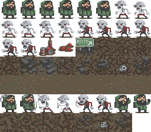

I used this sprite sheet that I found on the [Unity Asset Store](https://assetstore.unity.com/packages/essentials/tutorial-projects/2d-roguelike-29825) that was under Creative Commons, which means that I don't have to pay royalties to use it.  
I did however not use all the sprites, for example many of the sprites designed for animation, as I did not require them in my game.

### Algorithms

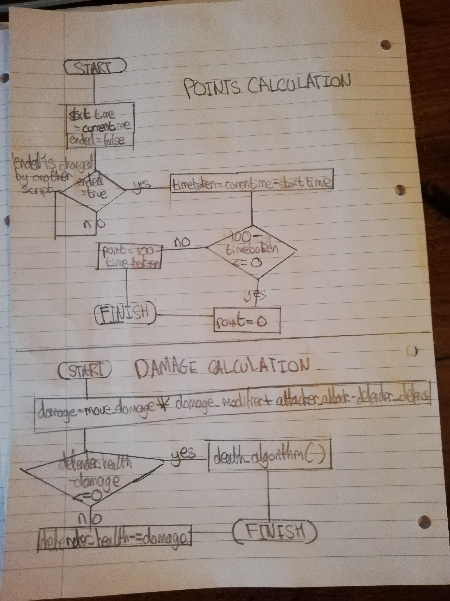
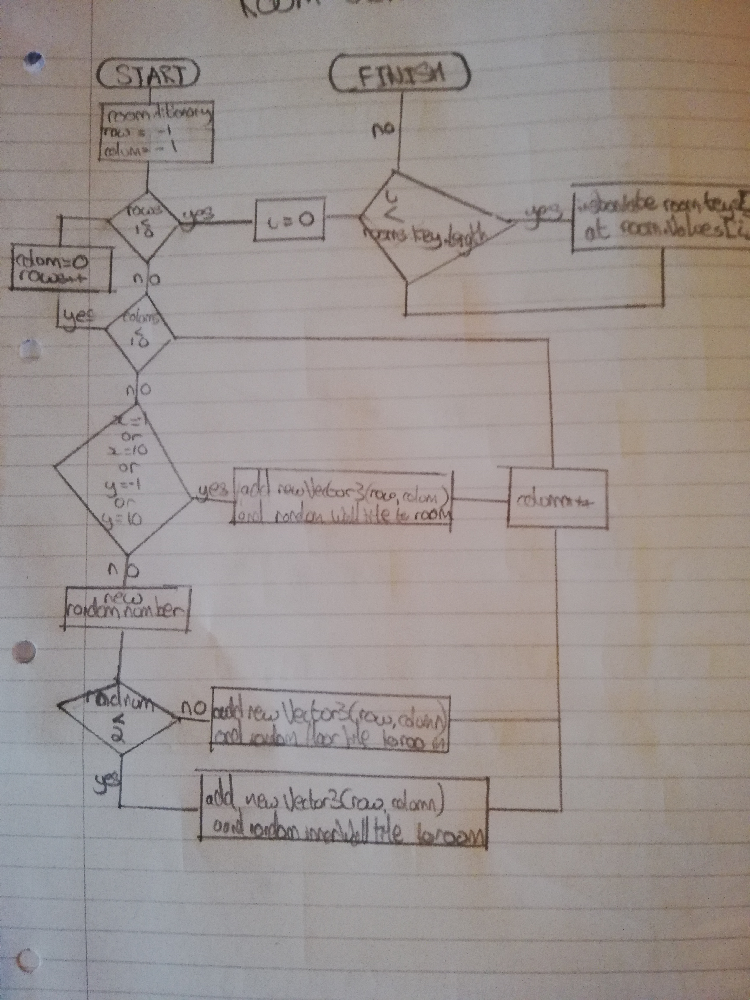

### Testing

#### Testing Environments

| Environment | CPU | RAM | GPU | Drive | OS| Unity Version |
| :----: | ---- | ---- | ---- | ---- | ---- | ---- |
| 1 | Intel i7-7500U | 8GB 2133MHz DDR4 | Intel® HD Graphics 620 (Kaby Lake GT2)  | SSD | Linux Ubuntu 16.04LTS 64bit | 2018.3.0f1 (Linux beta) |
| 2 | Ryzen R7 1800X | 8GB 3000GMHz DDR4 | MSI Armor 1070 8GB | SSD | Windows 10 Build No. 17134 | 2018.3.0f2|

#### Tests

#### Playability

These are a set of tests to test if the game is playable and if all of the features that I said I would impliment are presesnt.

| Test ID | Objective | Requirement ID | Description | Excepted Result | Result |
| :---: | ---- | ---- | ---- | ---- | ---- |
| #1 | Move the player with keys | #5 | The player should be able to move the main character with the WASD Keys | Using the WASD moves the player up, down, left and right respectively | Using the WASD moves the player up, down, left and right respectively. However, sometimes this does not work and the game must be restarted. |  
| #2 | Collision detection | #5 | The player should not be allowed to move into the same space as a wall object | The player is blocked by walls | The player is blocked by walls |
| #3 | Losing a fight | #6 | Losing a fight will remove a life | A life is lost when a fight is lost | A life is lost when a fight is lost |
| #4 | Losing the game | #6 | Losing all lives will end the game | The game ends when all lives are lost | The game ends when all lives are lost |
| #5 | Points won for a fight | #7 | More points should be gained if the player takes less time to win | The player gains more points the shorter the fight lasts |The player gains more points the shorter the fight lasts |
| #6 | Difficulty | #8 | Higher levels of difficulty will increase the how hard the enemy hits | More damage is dealt at higher levels | More damage is dealt at higher levels |
| #7 | Items to collect | #5 | The requirements say items need to be collected | Items should be able to be collected | There are no items to collect |
| #8 | Learnability | #2 | The game should be simple to learn | The game is simple to learn | The game is simple to learn |
| #9 | Lives | #6 | The player should have more than one life to begin with | The player has three lives | The player has three lives |
| #10 | There are hazards | #5 | Enemies should will appear randomly | The enemies appear randomly | The enemies appear randomly |

#### Compatibility Test

Different environments may handle a game differently. My two environments represent a wide range of systems that could run the game. Environment one is an Intel system running Linux and environment two is an AMD system running Windows 10. The only notable exception is MacOS based system, but I do not have access to them.

On my first test environment, the game built fine. The problem was getting it to run. However, I think this was an issue with the beta version of Unity that I was using. I was able to do the playability test through the editor itself.

The game build on my second test environment however and worked as intended.

#### Stability Test

This is a test if the game is able to run from start to finish, without any crashes or freezes.

I was able to play the game from start to finish at a stable 60fps (the generally accepted number of frames to make a game feel smooth) on both test environments. I feel the same results could be achieved on most computers, as there is not much processing powered required and I tested on two of the major operating systems.

#### User Acceptance Tests (UAT)

These are tests to get an idea if a consumer would think the games have met the requirements list to begin with. This is the closet thing to consumer feeback outside of releasing the game.

I completed two UAT tests, the first was from **Matthew Blackwell** and the second was from **Jack Francis**.

| # | Requirement                                                                                                        | Test Result |   | Comment                                                                                                  |
|---|--------------------------------------------------------------------------------------------------------------------|-------------|---|----------------------------------------------------------------------------------------------------------|
|   |                                                                                                                    | Y           | N |                                                                                                          |
| 1 | Be for 8 to 12-year olds.                                                                                          | y           |   |  I think that age group will enjoy it                                                                    |
| 2 | Simple to learn.                                                                                                   | y           |   | Its pretty easy to learn                                                                                 |
| 3 | Exciting to learn.                                                                                                 |             | n | Make it exciting, needs music                                                                            |
| 4 | Visually appealing.                                                                                                | y           |   | The sprites used fits the atmosphere of the game very well which makes the game visually appealing to me |
| 5 | The basic gameplay should be moving around an area, collecting items and with obstacles.                       |             | n | There aren’t any items                                                                                    |
| 6 | The player should also have several lives; these lives are used up by hazards.                                     | y           |   | Character has health and I’ve been told there are multiple lives                                         |
| 7 | There should also be a timing aspect that contributes to an overall score.                                         | y           |   | I didn’t see it, but I was told there is one later.                                                     |
| 8 | Different levels of difficulty should be implemented to make the game more challenging for easier for the player.  | y           |   | Multiple difficulties that can be chosen from                                                            |

| # | Requirement                                                                                                        | Test Result |   | Comment                                                                                                               |
|---|--------------------------------------------------------------------------------------------------------------------|-------------|---|-----------------------------------------------------------------------------------------------------------------------|
|   |                                                                                                                    | Y           | N |                                                                                                                       |
| 1 | Be for 8 to 12-year olds.                                                                                          | Y           |   | Very fun to play. Easy to learn                                                                                       |
| 2 | Simple to learn.                                                                                                   | Y           |   | See above. After 2 mins finished the game                                                                             |
| 3 | Exciting to learn.                                                                                                 | Y           |   | It was enthralling                                                                                                    |
| 4 | Visually appealing.                                                                                                | Y           |   | Attracts players look for a thrill                                                                                    |
| 5 | The basic gameplay should be moving around an area, collecting items and with obstacles.                       |           | N   | You cannot collect items.                                                                                             |
| 6 | The player should also have several lives; these lives are used up by hazards.                                     | Y           |   | The player has three lives that are removed upon losing a fight                                                       |
| 7 | There should also be a timing aspect that contributes to an overall score.                                         | Y           |   | The timer contributes to the score after the fight has been won                                                       |
| 8 | Different levels of difficulty should be implemented to make the game more challenging for easier for the player.  | Y           |   | The player can choose from 2 difficulties, normal, hard. The hard difficulty increases the difficulty of the enemies. |

Upon reading my feedback, I agree with both about both the positives and the negatives. It will be difficult for me to act on these changes however as both of the two main criticisms would require a large amount of work, requiring time that I don't have. If I were to make another game, these two items would be higher on my priority list.

### Evaluation

Generally, I did not need other people to complete this project. However, others were needed when testing ideas and doing the UAT testing. When they were required, I was able to get peers to review these tests quickly and effiecently as they were available when I needed them.

During my project, I chaged my laptop's operating system to Linux. This causes some problems to begin with, as Unity does not officially support Linux. After playing around with WINE (a Linux wrapper for Windows programs), I actually found an up to date version of Unity for Linux that was in a beta version. Throughout my project, I only had a few issues with this. Sometimes Unity Game Object components reset when moving my project from my Windows machine to my Linux version, or visa versa. Apart from these few problems, over all the hardware and software performed perfectly fine.

At the beginning of this project, I had no experience with Unity or C#. Over the Christmas break, I practiced my C# skills during work experience. This aided me in the development of this project, by acting as a base. Through following [tutorials](https://unity3d.com/learn/tutorials/s/2d-roguelike-tutorial), I was able to develop on these base C# skills and start to learn how to use Unity. Now, main through trial and error, I feel I have a good knowledge of how to use Unity and how to develop a large project.

Along with my inexperience with Unity, I had not done a large creative project like this before. Through this project, I have therefore had to develop my creative skills, such as justifying creative decisions, storyboarding and visual design.

One skill that I feel that I lacked during this project is good time management. Other factors such as, revision for other exams, has meant that finishing this project has been difficult. As a result, I was not able to meet all of the requirements and could not impliment all of the mechanics that I wanted to.

I will now review my game against all of my [requirements](#requirements).

| ID | Description | Comment |
| --- | --- | --- |
| 1 | *Be for 8 to 12-year olds.* | I feel that game does appeal to 8-12 year olds. It does not say a specific gender, so the fact it does lean more to boys doesn't matter that much. This is reflect d in my [UAT testing](#uat-test) with both people agreeing with me. |
| 2 | *Simple to learn.* | The game is simple to learn. I did not use that many moves, only 4 that are all self-explanatory. This again is reflected in my [UAT testing](#uat-test), with it Jack Francis saying "Very fun to play. Easy to learn" in response to the first requirement.|
| 3 | *Exciting to learn.* | I do not think the game is exciting to learn. Matthew Blackwell from my [UAT testing](#uat-test) agrees. However, interestingly Jack Francis disagrees with me and says "It was enthralling". |
| 4 | *Visually appealing.*  | This game is not visually, for a reason. If it was with bright colours, then it wouldn't fit into the [story](#story) of it being set in a post apocalyptic world. |
| 5 | *The basic gameplay should be moving around an area, collecting items and with obstacles.* | The game does not have any items to pick up. I did want to impliment this, however I was unable to. It does however have obstacles and the basic gameplay does consist of the player moving around an area. |
| 6 | *The player should also have several lives; these lives are used up by hazards.* | I met this requirement fully and this was reflected in my [UAT testing](#uat-test). |
| 7 | *There should also be a timing aspect that contributes to an overall score.* | There is a timing element. The first Matthew Blackwell says "I didn’t see it, but I was told there is one later". I could probably have made the timing element more apparent, as it comes into account when calculating your score from winning a fight. |
| 8 | *Different levels of difficulty should be implemented to make the game more challenging for easier for the player.* | I met this requirement fully and this was reflected in my [UAT testing](#uat-test). |

Although it does not fit all the requirements, I am generally happy with my game as it does still fit with the "main" requirements.

Of course there could be improvements, as with any project. If I had more time I would definitely try and get rid of some of the bug, for example the controls not always working that was found during [testing (#1)](#testing).

There were mechanics I also wanted to impliment that I did not have time to code. These can be seen in the [mechanics](#mechanics) section, and include a shop feature and item pick up system. This would have added a new dimension to the game, with different items having different effects, and would make the game better fit with the requirements

I was responsible for the entire development of this project, which meant I was solely responsible for any issues face. This could be as small as a bug, or as large as time management. The latter was a big problem of mine. If I had kept to me [project plan](#project-plan) that I had made before I began development then maybe these issues could have been avoided. However, I do also think my [project plan](#project-plan) was flawed as well. For example I did not break the development down of the game enough, so I couldn't
work towards specific deadlines during that project.

As I created to game, I personally was reviewing it constantly, making sure that it relates back to requirements that I set myself at the beginning of the project. At the end of the project I also completed [10 playability tests](#playability), two [compatibility test](#compatibility-test) on two entirely different environments and two [UAT test](#uat-test) (which allowed me to get the opinions of other people) to review my work.

During the development of this project, keeping the work safe and secure was a major priority of mine.

To begin with I tried to use the "Unity Collab" feature, that stores your project on Unity's servers. This only caused problems, I think this is probably because the beta version of Unity that was using on Linux did not fully support it.

I then switched to using Microsoft's OneDrive cloud service to keep back ups of my game and also transfer the project between my development environments. This method worked well, however I sometimes found that files did not sync when moved into my OneDrive folder on my Windows environment, so I had to be sure that I did actually sync the files. There were also limits on the types of files that I could upload (i.e. exe files were restricted), so I had to re-import the game every time I downloaded the project from OneDrive.

I then finally moved to making a Samba share on my laptop, that allowed me to move the files from between my systems (as long as they were on the same network) without having to deal with the middle-man, like OneDrive. This worked the best as I knew for sure that my project was up to date on both of my systems, and I had more control over what types of files I could upload.

Overall, my project was kept safe and I didn't ever lose progress due to losing files.

Through out this project I was aware of the [legal and ethical considerations](#legal-and-ethical-considerations) that I outlined before starting my project, making sure that any assets that used came under creative commons, so I didn't have to pay for royalties, or I made my own.

I am generally happy with how this project went, considering how I started it with not knowledge at all of how Unity worked. If I had managed my time better, or had another person working on it with me, then I could have better completed the game.

### Appendix

#### Screenshots

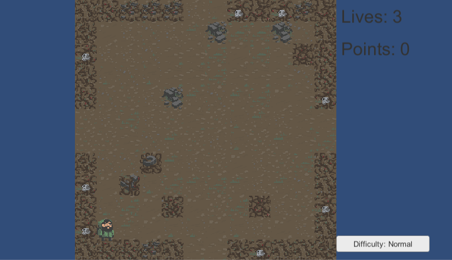  
Here the player has started the game.

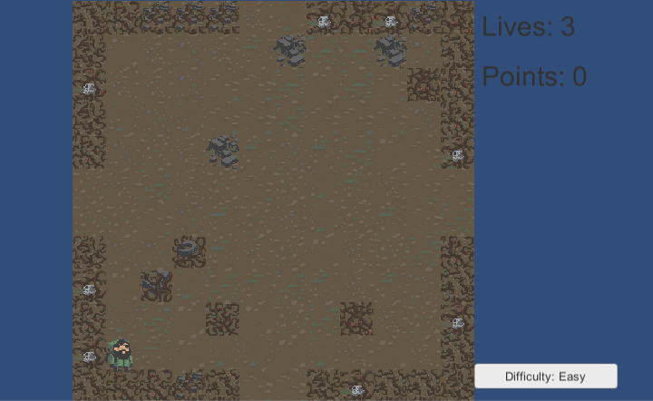  
The player changed the difficulty to easy.

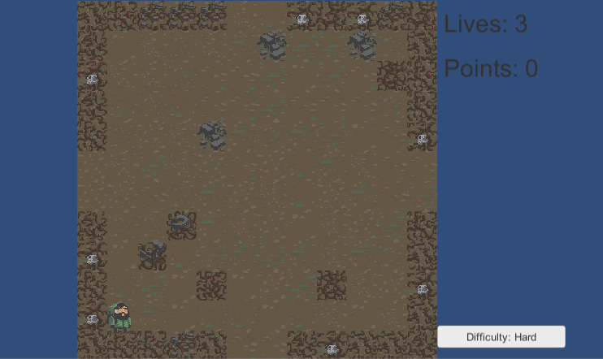  
The player changed the difficulty to hard.

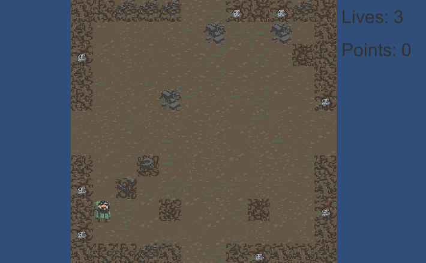  
The player moves one space up and can no longer change the difficulty

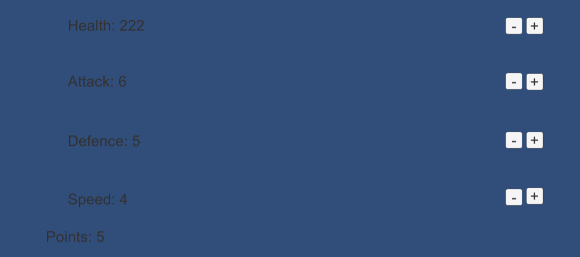  
The player can enter and change their stats in the level up screen

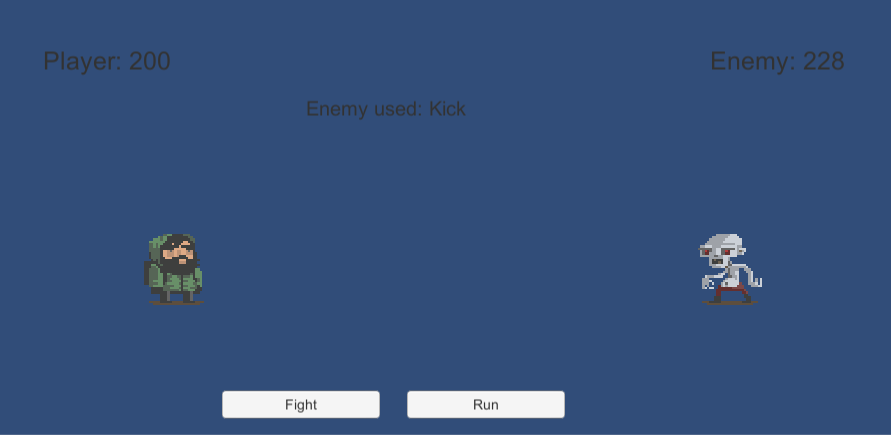  
The player enters a fight and can either fiht or run. The enemy used kick, a randomly selected move.

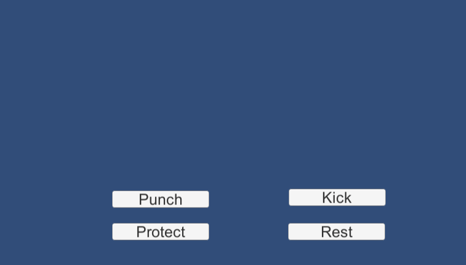  
The player can chose which move they want to do.

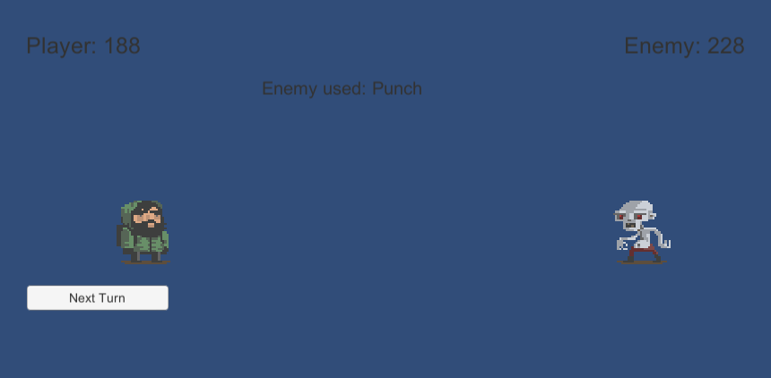  
The player must press the ``next turn`` button in order to continue the fight.

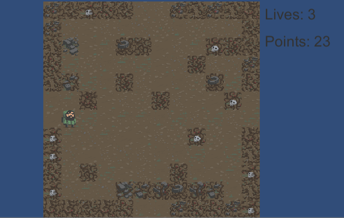  
The player has going points from a fight previously and has entered a new room.

#### Code

##### buttonScript.cs

```c#
using System.Collections;
using System.Collections.Generic;
using UnityEngine;

public class buttonScript : MonoBehaviour
{
    private Dictionary<string, string> int_stats;
    private Dictionary<string, int> _ps;
    private int startPoints;

    private void Start() {
        int_stats = new Dictionary<string, string>();
        int_stats.Add("_1", "Health");
        int_stats.Add("_2", "Attack");
        int_stats.Add("_3", "Defence");
        int_stats.Add("_4", "Speed");
    }

    private string get_name(string bn)
    {
        char[] chars = bn.ToCharArray();
        List<char> nameL =  new List<char>();

        foreach(char c in chars)
        {
            if(c.ToString() == "_")
                break;
            else
                nameL.Add(c);
        }

        return new string(nameL.ToArray());
    }

    public void change_stats(GameObject button)
    {
        _ps = GameObject.Find("EventSystem(Clone)").GetComponent<uiGen>()._ps;

        string buttonName = button.name;
        string statName = get_name(buttonName);
        string type = buttonName.Substring((statName.Length + 1)).Trim();

        switch(type)
        {
            case "Plus":
                if (_ps["Points"]>0)
                {
                    _ps["Points"]--;
                    _ps[statName]++;
                    GameObject.Find("EventSystem(Clone)").GetComponent<uiGen>().update_text();
                }
                break;

            case "Minus":
                if((_ps["Points"]+1)<=GameObject.Find("EventSystem(Clone)").GetComponent<uiGen>().start_points)
                {
                    _ps["Points"]++;
                    _ps[statName]--;
                    GameObject.Find("EventSystem(Clone)").GetComponent<uiGen>().update_text();
                }
                break;
        }
    }
}
```

##### dugeonGen.cs

```c#
using System.Collections;
using UnityEngine;
using UnityEngine.SceneManagement;
using System.Collections.Generic;
using Random = UnityEngine.Random;
using UnityEngine.UI;
using UnityEngine.EventSystems;

public class dungeonGen : MonoBehaviour
{
    public int columns = 10;
    public int rows = 10;
    public GameObject[] wallTiles;
    public GameObject[] floorTiles;
    public GameObject[] innerWallTiles;
    public GameObject player;
    public System.Random r = new System.Random();
    private List<Vector3> gridPostions;
    public Dictionary<Vector3, GameObject> room;
    private GameObject iworld;
    public GameObject world_canvas;

    private void initPos(int rows, int columns)
    {
        for (int x = -1; x < rows - 1; x++)
        {
            for (int y = -1; y < columns - 1; y++)
            {
                gridPostions.Add(new Vector3(x, y, 0f));
            }
        }
    }

    private Dictionary<Vector3, GameObject> genDungeon()
    {
        Dictionary<Vector3, GameObject> room = new Dictionary<Vector3, GameObject>();

        for (int x = -1; x < rows + 1; x++)
        {
            for (int y = -1; y < columns + 1; y++)
            {
                GameObject toInstantiate;
                if (x == -1 || x == columns || y == -1 || y == rows)
                {
                    toInstantiate = wallTiles[Random.Range(0, (wallTiles.Length - 1))];
                }

                else
                {
                    int rnd = r.Next(1, 10);
                    if (rnd > 0 && rnd < 2)
                    {
                        toInstantiate = innerWallTiles[Random.Range(0, innerWallTiles.Length)];
                    }

                    else
                    {
                        toInstantiate = floorTiles[Random.Range(0, floorTiles.Length)];
                    }  
                }

                room.Add(new Vector3(x, y, 0f), toInstantiate);

            }
        }

        return room;

    }

    void instantiate_dungeon(Dictionary<Vector3, GameObject> tiles)
    {
        bool flag = false;
        int counter = 0;
        iworld = Instantiate(new GameObject(), new Vector2(0,0), Quaternion.identity);
        Vector2[] d_xy = new Vector2[] {new Vector3(-1, 4), new Vector3(-1, 5), new Vector3(4, -1), new Vector3(5, -1), new Vector3(4, 10), new Vector3(5, 10), new Vector3(10, 4), new Vector3(10, 5)};

        foreach(KeyValuePair<Vector3, GameObject> tile in tiles)
        {
            Vector3 tilexy = tile.Key;
            foreach(Vector3 xy in d_xy)
            {
                if (xy == tilexy)
                {
                    flag = true;
                    GameObject door = floorTiles[Random.Range(0, (floorTiles.Length -1))];
                    GameObject doorObj = Instantiate(door, xy, Quaternion.identity) as GameObject;
                    // doorObj.AddComponent<doorScript>();
                    doorObj.transform.SetParent(GameObject.Find("New Game Object(Clone)").transform);
                    doorObj.name = $"Door {counter}";

                    counter ++;
                    break;
                }
            }
            if (!flag)
            {
                GameObject instance = Instantiate(tile.Value, tile.Key, Quaternion.identity) as GameObject;
                instance.transform.SetParent(iworld.transform);
            }
            flag = false;
        }
    }

    void instantiate_player(float x, float y){
        GameObject playerInstance = Instantiate(player, new Vector3(x, y, -0.2f), Quaternion.identity);
        playerInstance.transform.SetParent(iworld.transform);
    }
    void dungeonCleanUp()
    {
        Destroy(GameObject.Find("New Game Object"));

        GameObject floor = Instantiate(floorTiles[Random.Range(0, floorTiles.Length)], new Vector3(0f,0f,0f), Quaternion.identity);
        floor.transform.SetParent(iworld.transform);
    }

    void instantiate_buttons()
    {
        Instantiate(GameObject.Find("GameManager").GetComponent<gameManager>().eventSystem);
        GameObject UI = Instantiate(world_canvas);
        UI.transform.GetChild(0).gameObject.GetComponent<Text>().text = $"Lives: {GameObject.Find("GameManager").GetComponent<gameManager>().lives}";
        UI.transform.GetChild(1).gameObject.GetComponent<Text>().text = $"Points: {(int) GameObject.Find("GameManager").GetComponent<gameManager>().Points}";
        GameObject.Find("World_Canvas(Clone)").transform.GetChild(2).gameObject.GetComponentInChildren<Text>().text = $"Difficulty: {GameObject.Find("GameManager").GetComponent<gameManager>().difficulty}";
    }

    public void generate_dungeon(Dictionary<Vector3, GameObject> room, float x, float y)
    {
        instantiate_dungeon(room);
        dungeonCleanUp();
        instantiate_player(x, y);
        instantiate_buttons();
    }

    public void new_dungeon(float x, float y)
    {
        Vector2 newxy = new Vector2(0f,0f);
        GameObject parentObject = GameObject.Find("New Game Object(Clone)").gameObject;
        int childs = parentObject.transform.GetChildCount();
        for (int i = 0; i < childs; i++)
        {
            Destroy(parentObject.transform.GetChild(i).gameObject);
        }
        Destroy(parentObject);

        int pos = -1;

        Vector2[] doors = new Vector2[] {new Vector3(-1, 4), new Vector3(-1, 5), new Vector3(4, -1), new Vector3(5, -1), new Vector3(4, 10), new Vector3(5, 10), new Vector3(10, 4), new Vector3(10, 5)};
        for (int i = 0; i < doors.Length; i++)
        {
            if (doors[i] == new Vector2(x, y))
            {
                pos = i;
                break;
            }
        }

        switch(pos)
        {
            case 0:
                newxy = new Vector2(9, 4);
                break;
            case 1:
                newxy = new Vector2(9, 5);
                break;
            case 2:
                newxy = new Vector2(4, 9);
                break;
            case 3:
                newxy = new Vector2(5, 9);
                break;
            case 4:
                newxy = new Vector2(4, 0);
                break;
            case 5:
                newxy = new Vector2(5, 0);
                break;
            case 6:
                newxy = new Vector2(0, 4);
                break;
            case 7:
                newxy = new Vector2(0, 5);
                break;
        }

        room = genDungeon();
        generate_dungeon(room, newxy.x, newxy.y);
    }

    void Start()
    {

        gridPostions = new List<Vector3>();
        initPos(rows, columns);
        room = genDungeon();
        generate_dungeon(room, 0f, 0f);

        GameObject.Find("GameManager").GetComponent<gameManager>().change_play();
    }

}
```

##### fightManager.cs

```c#
using System;
using System.Collections;
using System.Collections.Generic;
using System.Diagnostics;
using UnityEngine;
using UnityEngine.UI;
using UnityEngine.EventSystems;
using Random = UnityEngine.Random;
using Debug = UnityEngine.Debug;
public class fightManager : MonoBehaviour
{
    private Dictionary<string, int> Estats;
    public Dictionary<string, List<float>> moves_list;
    private List<string> move_names;
    public GameObject moveCanvas;
    private GameObject UI;
    private string effect;

    void Start()
    {
        Estats = new Dictionary<string, int>();

        moves_list = new Dictionary<string, List<float>>();
        moves_list.Add("Punch", new List<float>{20, 8, 20});
        moves_list.Add("Kick", new List<float>{40, 8, 10});
        moves_list.Add("Protect", new List<float>{0, 10, 5});
        moves_list.Add("Rest", new List<float>{0, 10, 5});

        move_names = new List<string>();

        foreach(KeyValuePair<string, List<float>> kvp in moves_list)
            move_names.Add(kvp.Key);
    }

    private void Update() {
        // Debug.Log(DateTime.UtcNow);
    }

    public void first()
    {
        Estats["Health"] = Random.Range(200, 300);
        Estats["Attack"] = Random.Range(1, 10);
        Estats["Defence"] = Random.Range(1, 10);
        Estats["Speed"] = Random.Range(1, 10);
        Estats["Points"] = 5;

        updateHealth();
    }

    private string doMove(string move_name)
    {
        float damage = 0;

        List<float> move_stats = GameObject.Find("GameManager").GetComponent<fightManager>().moves_list[move_name];

        if (Random.Range(0, 10) <= (move_stats[1]))
        {
            if ((move_name == "Punch" || move_name == "Kick"))
            {
                if (effect == "Protect")
                {
                    effect = "";
                    switch (GameObject.Find("GameManager").GetComponent<fightManager>().turn)
                    {
                        case false:
                            return $"Player protected itself.";

                        case true:
                            return $"Enemy protected itself.";
                    }
                }
                else
                {
                    switch (GameObject.Find("GameManager").GetComponent<fightManager>().turn)
                    {
                        case false:
                            GameObject.Find("GameManager").GetComponent<fightManager>().Pstats["Health"] -= (int) (move_stats[0] * GameObject.Find("GameManager").GetComponent<gameManager>().damage_mod) + GameObject.Find("GameManager").GetComponent<fightManager>().Estats["Attack"] - GameObject.Find("GameManager").GetComponent<fightManager>().Pstats["Defence"];;
                            return $"Enemy used: {move_name}";

                        case true:
                            GameObject.Find("GameManager").GetComponent<fightManager>().Estats["Health"] -= (int) (move_stats[0] * GameObject.Find("GameManager").GetComponent<gameManager>().damage_mod) + GameObject.Find("GameManager").GetComponent<fightManager>().Estats["Attack"] - GameObject.Find("GameManager").GetComponent<fightManager>().Pstats["Defence"];;
                            return $"Player used: {move_name}";
                    }
                }
            }

            else if (move_name == "Protect")
            {
                effect = "Protect";
                switch (GameObject.Find("GameManager").GetComponent<fightManager>().turn)
                {
                    case false:
                        return $"Enemy used: {move_name}";

                    case true:
                        return $"Player used: {move_name}";
                }
            }

            else if (move_name == "Rest")
            {
                switch (GameObject.Find("GameManager").GetComponent<fightManager>().turn)
                {
                    case true:
                        GameObject.Find("GameManager").GetComponent<fightManager>().Pstats["Health"] += 10;
                        return $"Player used: {move_name}";

                    case false:
                    GameObject.Find("GameManager").GetComponent<fightManager>().Estats["Health"] += 10;
                        return $"Enemy used: {move_name}";
                }
            }
        }
        else
        {
            switch (GameObject.Find("GameManager").GetComponent<fightManager>().turn)
                {
                    case true:
                        return $"Player missed";

                    case false:
                        return $"Enemy missed";
                }
        }

        return "";
    }

    private void updateHealth()
    {
        UI = GameObject.Find("fightCanvas(Clone)");
        for(int i = 0; i < UI.transform.GetChildCount(); i++)
        {
            if (UI.transform.GetChild(i).gameObject.name == "fHealth")
                UI.transform.GetChild(i).gameObject.GetComponent<Text>().text = $"Player: {GameObject.Find("GameManager").GetComponent<gameManager>().player_stats["Health"]}";
            else if (UI.transform.GetChild(i).gameObject.name == "eHealth")
                UI.transform.GetChild(i).gameObject.GetComponent<Text>().text = $"Enemy: {GameObject.Find("GameManager").GetComponent<fightManager>().Estats["Health"]}";
        }
    }

    private void enemyTurn()
    {
        GameObject.Find("GameManager").GetComponent<fightManager>().turn = false;
        string move = GameObject.Find("GameManager").GetComponent<fightManager>().move_names[Random.Range(1,2)];

        GameObject.Find("fightCanvas(Clone)").transform.GetChild(5).gameObject.GetComponent<Text>().text = doMove(move);

        updateHealth();

        if (GameObject.Find("GameManager").GetComponent<fightManager>().Pstats["Health"] <= 0)
        {
            UI.transform.GetChild(3).gameObject.GetComponent<Text>().text = "Player: 0";
            endGame(false);
        }
        else
        {
            updateHealth();

            GameObject.Find("GameManager").GetComponent<fightManager>().turn = true;
            GameObject.Find("fightCanvas(Clone)").transform.GetChild(6).gameObject.SetActive(true);
        }
    }

    private void endGame(bool win)
    {
        GameObject.Find("GameManager").GetComponent<fightManager>().ended = true;
        GameObject.Find("fightCanvas(Clone)").transform.GetChild(0).gameObject.SetActive(false);
        GameObject.Find("fightCanvas(Clone)").transform.GetChild(1).gameObject.SetActive(false);
        GameObject.Find("fightCanvas(Clone)").transform.GetChild(2).gameObject.SetActive(false);

        switch(win)
        {
            case true:
                GameObject.Find("fightCanvas(Clone)").transform.GetChild(5).gameObject.GetComponent<Text>().text = "You win!";
                GameObject.Find("fightCanvas(Clone)").transform.GetChild(6).gameObject.SetActive(true);
                GameObject.Find("fightCanvas(Clone)").transform.GetChild(6).gameObject.transform.GetChild(0).GetComponent<Text>().text = "End fight";
                break;
            case false:
                if (!checkDead())
                {
                    GameObject.Find("fightCanvas(Clone)").transform.GetChild(5).gameObject.GetComponent<Text>().text = "You lose!";
                    GameObject.Find("fightCanvas(Clone)").transform.GetChild(6).gameObject.SetActive(true);
                    GameObject.Find("fightCanvas(Clone)").transform.GetChild(6).gameObject.transform.GetChild(0).GetComponent<Text>().text = "End fight";
                }
                break;
        }

        GameObject.Find("GameManager").GetComponent<fightManager>().Stopwatch.Stop();
        GameObject.Find("GameManager").GetComponent<gameManager>().Points += (1 / GameObject.Find("GameManager").GetComponent<fightManager>().Stopwatch.ElapsedMilliseconds) * 1000;
        Debug.Log((1 / GameObject.Find("GameManager").GetComponent<fightManager>().Stopwatch.ElapsedMilliseconds) * 1000);
    }

    private bool checkDead()
    {
        if ((GameObject.Find("GameManager").GetComponent<gameManager>().lives-1) == 0)
        {
            Destroy(GameObject.Find("01(Clone)"));
            Destroy(GameObject.Find("Player(Clone)"));

            for(int i = 0; i < 6; i ++)
            {
                if (i != 6)
                {
                    GameObject.Find("fightCanvas(Clone)").transform.GetChild(i).gameObject.SetActive(false);
                }
                else
                {
                    GameObject.Find("fightCanvas(Clone)").transform.GetChild(i).GetComponentInChildren<Text>().text = "You have died.";
                }
            }

            return true;
        }
        else
        {
            GameObject.Find("GameManager").GetComponent<gameManager>().lives--;
            return false;
        }
    }
    public void nextTurnClick()
    {
        if (GameObject.Find("GameManager").GetComponent<fightManager>().ended)
            GameObject.Find("GameManager").GetComponent<gameManager>().scene_to_world(true);
        else
        {
            GameObject.Find("fightCanvas(Clone)").transform.GetChild(6).gameObject.SetActive(false);
            switch(GameObject.Find("GameManager").GetComponent<fightManager>().turn)
            {
                case true:
                    GameObject.Find("GameManager").GetComponent<fightManager>().turn = false;
                    GameObject.Find("fightCanvas(Clone)").transform.GetChild(0).gameObject.SetActive(true);
                    GameObject.Find("fightCanvas(Clone)").transform.GetChild(1).gameObject.SetActive(true);
                    GameObject.Find("fightCanvas(Clone)").transform.GetChild(2).gameObject.SetActive(true);
                    break;

                case false:
                    GameObject.Find("GameManager").GetComponent<fightManager>().turn = true;
                    enemyTurn();
                    break;
            }
        }
    }

    public void onClick(GameObject go)
    {
        switch (go.name)
        {
            case "Fight":
                fight_click();
                break;

            case "Run":
                run_click();
                break;

            case "Bag":
                break;
        }
    }

    public void move_click(GameObject go)
    {
        Destroy(GameObject.Find("moveCanvas(Clone)"));

        if (GameObject.Find("GameManager").GetComponent<fightManager>().Estats["Health"] <= 0)
        {
            UI.transform.GetChild(4).gameObject.GetComponent<Text>().text = "Enemy: 0";
            endGame(true);
        }

        else
        {
            Instantiate(GameObject.Find("GameManager").GetComponent<gameManager>().fightUI);
            Instantiate(GameObject.Find("GameManager").GetComponent<gameManager>().playerf);
            Instantiate(GameObject.Find("GameManager").GetComponent<gameManager>().enemy);

            GameObject.Find("fightCanvas(Clone)").transform.GetChild(0).gameObject.SetActive(false);
            GameObject.Find("fightCanvas(Clone)").transform.GetChild(1).gameObject.SetActive(false);
            GameObject.Find("fightCanvas(Clone)").transform.GetChild(2).gameObject.SetActive(false);

            GameObject.Find("fightCanvas(Clone)").transform.GetChild(5).gameObject.GetComponent<Text>().text = doMove(go.GetComponent<Text>().text);
            updateHealth();

            GameObject.Find("GameManager").GetComponent<fightManager>().turn = false;
            GameObject.Find("fightCanvas(Clone)").transform.GetChild(6).gameObject.SetActive(true);
        }
    }

    private void fight_click()
    {
        Debug.Log("fight click");
        string[] to_destroy = new string[] {"fightCanvas(Clone)", "01(Clone)", "Player(Clone)"};
        foreach (string item in to_destroy)
            Destroy(GameObject.Find(item));
        moveCanvas = GameObject.Find("GameManager").GetComponent<fightManager>().moveCanvas;
        Instantiate(moveCanvas);
    }
    private void run_click()
    {
        int rnd = Random.Range(0, 20);
        if (rnd < 15)
            Destroy(GameObject.Find("fightCanvas(Clone)"));
            GameObject.Find("GameManager").GetComponent<gameManager>().scene_to_world(true);
    }
}
```

##### gameManager.cs

```c#
using System;
using System.Collections;
using System.Collections.Generic;
using System.Diagnostics;
using UnityEngine;
using System.Threading;
using UnityEngine.UI;
using UnityEngine.EventSystems;
using Random = UnityEngine.Random;
using Debug = UnityEngine.Debug;

public class gameManager : MonoBehaviour
{
    public int lives = 3;
    public bool play = false;
    public GameObject canvas;
    public GameObject eventSystem;
    public string scene = "World";
    private Dictionary<Vector3, GameObject> current_dugeon;
    private float[] PlayerXY;
    public GameObject enemy;
    public GameObject playerf;
    public GameObject fightUI;  
    public Dictionary<string, int> player_stats;
    public string difficulty;
    public float damage_mod;

    public void change_play()
    {
        switch(play)
        {
            case false:
                play = true;
                break;
            case true:
                play = false;
                break;
        }
    }

    private float[] get_xy()
    {
        float[] xy = new float[2];
        xy[0] = GameObject.Find("Player(Clone)").GetComponent<PlayerController>().x;
        xy[1] = GameObject.Find("Player(Clone)").GetComponent<PlayerController>().y;
        return xy;
    }

    public void scene_to_fight()
    {
        Debug.Log("Changing to fight scene.");
        change_play();
        scene="Fight";
        current_dugeon = GameObject.Find("GameManager").GetComponent<dungeonGen>().room;
        PlayerXY = get_xy();

        Destroy(GameObject.Find("New Game Object(Clone)"));
        Destroy(GameObject.Find("World_Canvas(Clone)"));
        Destroy(GameObject.Find("EventSystem(Clone)"));

        Instantiate(enemy);
        Instantiate(playerf);
        Instantiate(eventSystem);
        GameObject UI = Instantiate(fightUI);

        GameObject.Find("GameManager").GetComponent<fightManager>().first();
        GameObject.Find("GameManager").GetComponent<fightManager>().Pstats = player_stats;
        GameObject.Find("GameManager").GetComponent<fightManager>().turn = true;
        GameObject.Find("GameManager").GetComponent<fightManager>().Stopwatch = new Stopwatch();
        GameObject.Find("GameManager").GetComponent<fightManager>().Stopwatch.Start();
        GameObject.Find("fightCanvas(Clone)").transform.GetChild(6).gameObject.SetActive(false);
    }

    public void scene_to_ui(){
        Debug.Log("Changing to level scene.");
        change_play();
        scene = "UI";
        current_dugeon = GameObject.Find("GameManager").GetComponent<dungeonGen>().room;
        PlayerXY = get_xy();

        Destroy(GameObject.Find("New Game Object(Clone)"));
        Destroy(GameObject.Find("World_Canvas(Clone)"));
        Destroy(GameObject.Find("EventSystem(Clone)"));


        Instantiate(canvas, new Vector3(0f,0f,0f), Quaternion.identity) ;
        Instantiate(eventSystem, new Vector3(0f, 0f, 0f), Quaternion.identity);

        GameObject.Find("EventSystem(Clone)").GetComponent<uiGen>().start_ui(canvas, eventSystem, player_stats);

    }

    public void scene_to_world(bool from_fight)
    {
        Debug.Log("Changing to world scene.");
        scene = "World";

        Destroy(GameObject.Find("EventSystem(Clone)"));
        Destroy(GameObject.Find("Canvas(Clone)"));
        if (from_fight)
        {
            Destroy(GameObject.Find("EventSystem(Clone)"));
            Destroy(GameObject.Find("fightCanvas(Clone)"));
            Destroy(GameObject.Find("01(Clone)"));
            Destroy(GameObject.Find("Player(Clone)"));
        }

        GameObject.Find("GameManager").GetComponent<dungeonGen>().generate_dungeon(current_dugeon, PlayerXY[0], PlayerXY[1]);
        change_play();
    }

    private void Update() {
        if(Input.GetKeyDown(KeyCode.E))
        {
            switch(scene)
            {
                case "World":
                    scene_to_ui();
                    break;
                case "UI":
                    scene_to_world(false);
                    break;
            }
        }
    }

    private void Start() {
        difficulty = "Normal";
        player_stats = new Dictionary<string, int>();
        player_stats.Add("Health", Random.Range(200, 300));
        player_stats.Add("Attack", Random.Range(1, 10));
        player_stats.Add("Defence", Random.Range(1, 10));
        player_stats.Add("Speed", Random.Range(1, 10));
        player_stats.Add("Points", 5);
    }
}
```

##### uiGen.cs

```c#
using System.Collections;
using System.Collections.Generic;
using UnityEngine;
using UnityEngine.UI;
using UnityEngine.EventSystems;

public class uiGen : MonoBehaviour
{
    private GameObject _c;
    public Dictionary<string, int> _ps;
    public void start_ui(GameObject canvas, GameObject eventSystem, Dictionary<string, int> player_stats)
    {
        _ps = player_stats;

        _c = GameObject.Find("Canvas(Clone)");

        update_text();

    }

    public void update_text()
    {
        foreach(Transform t in _c.transform)
        {
            foreach (KeyValuePair<string, int> kvp in _ps)
            {
                if (t.name == kvp.Key)
                {
                    Text text = t.GetComponent<Text>();
                    text.fontSize = 25;
                    text.text = $"{kvp.Key}: {kvp.Value}";
                }
            }
        }
    }
}
```